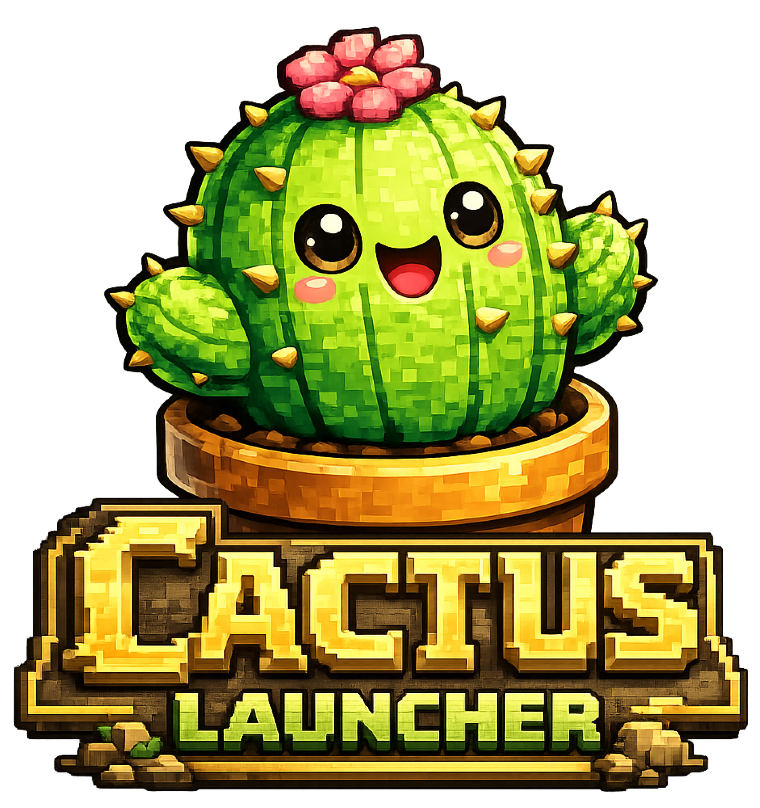
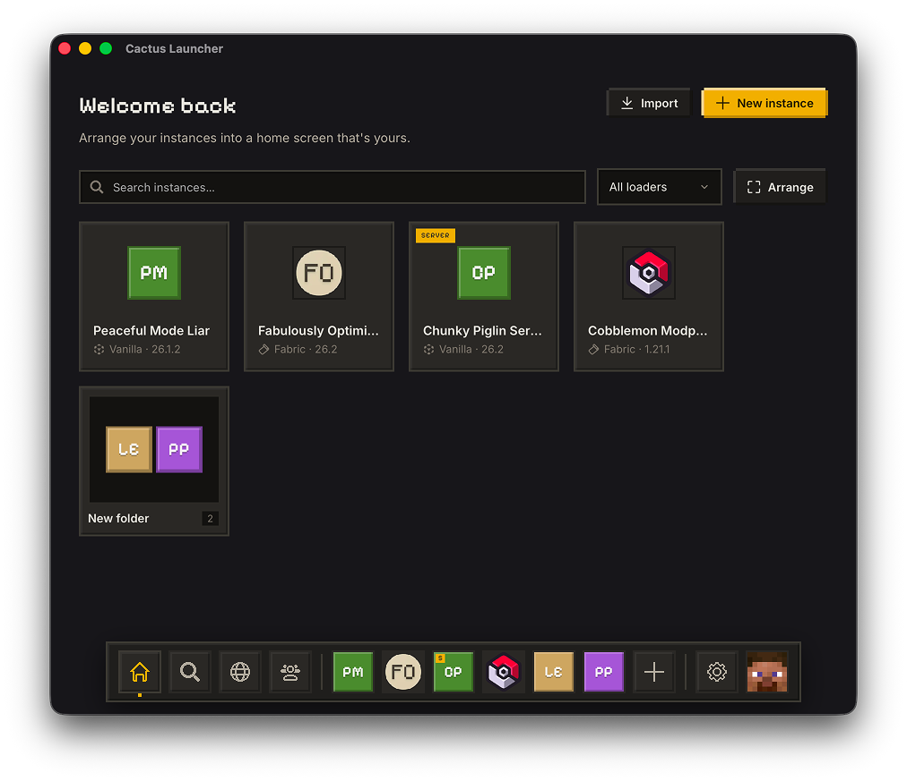
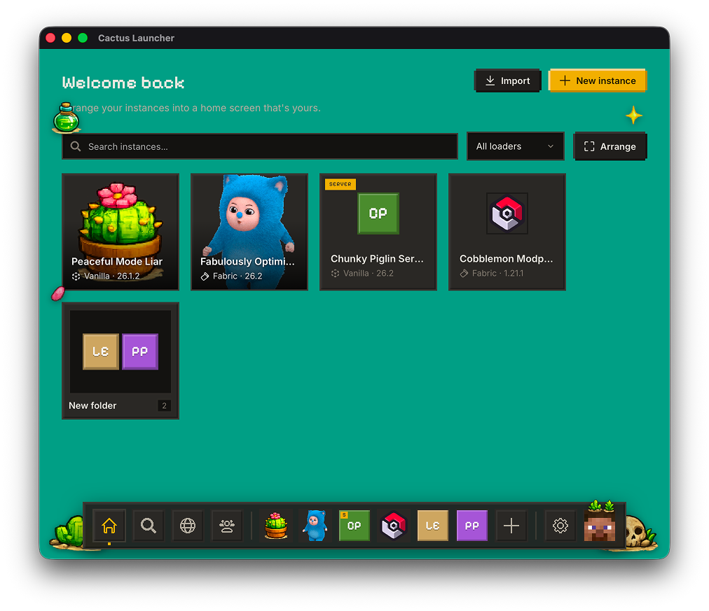
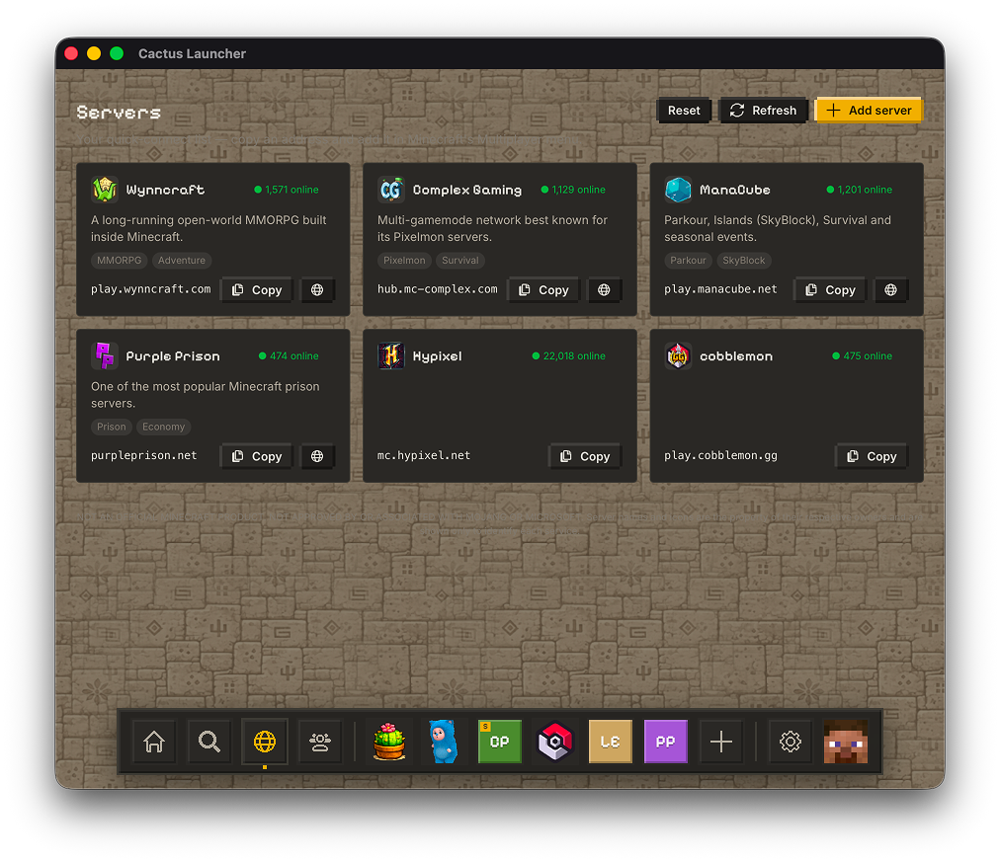
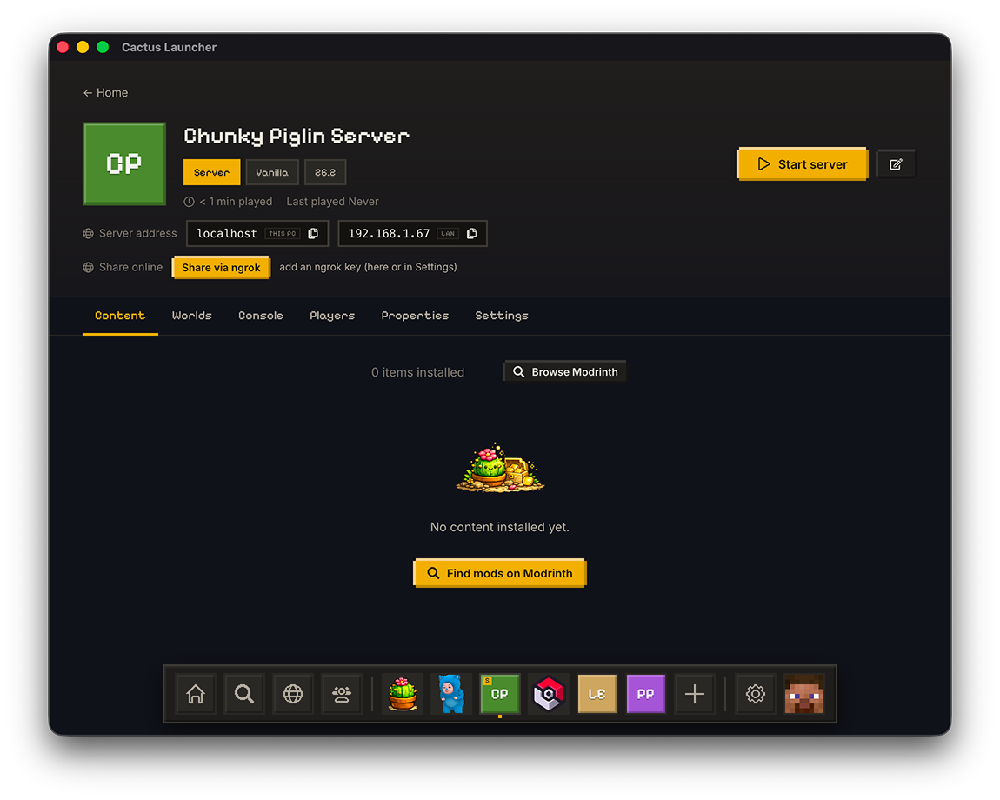
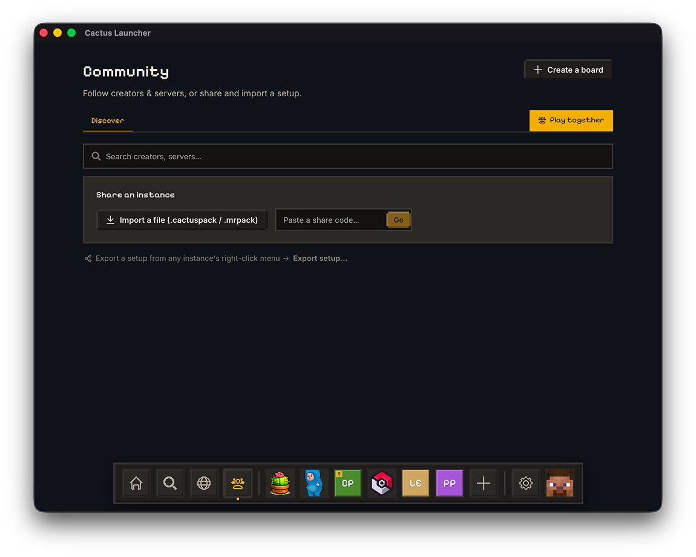
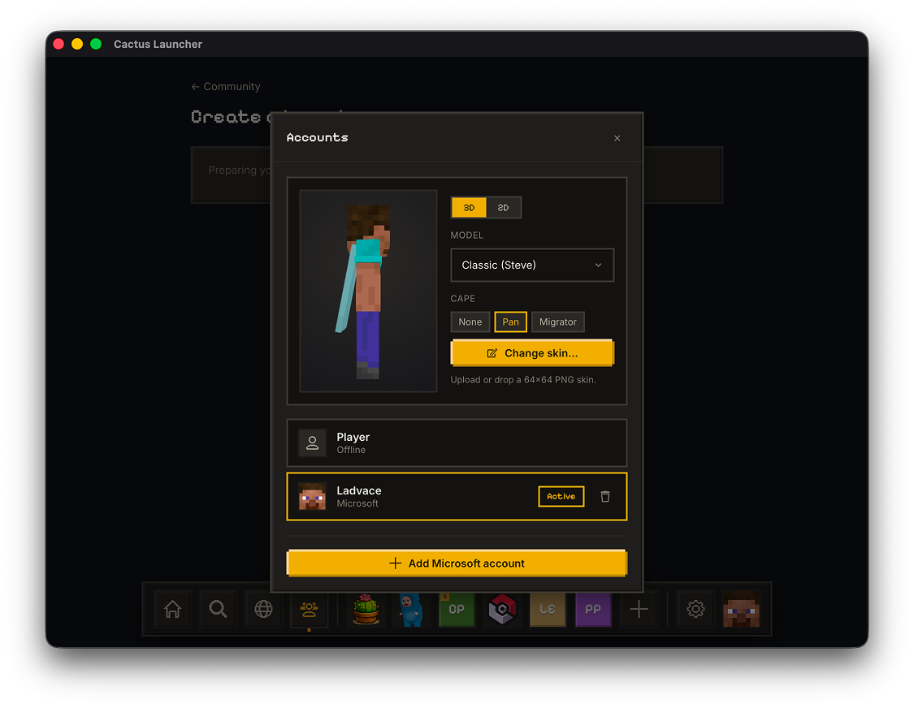
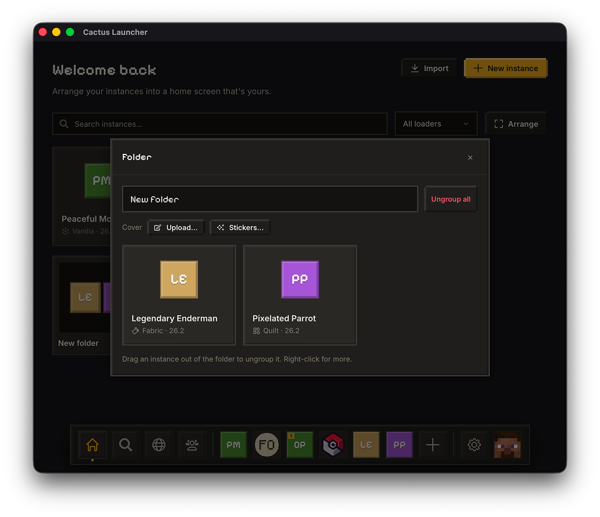
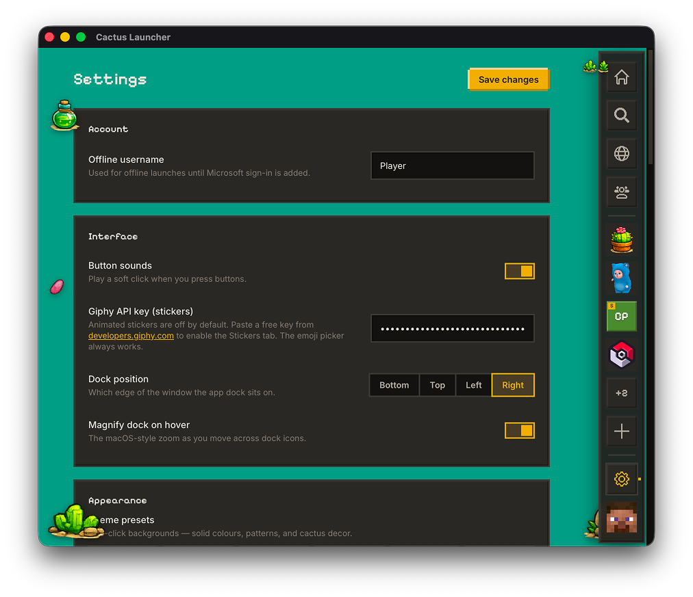

<div align="center">



# Cactus Launcher

**A cozy, fast, ad-free Minecraft launcher.**
Arrange your instances, install mods, run servers, and play together.

_Spiky, but not spooky._ 🌵

[](https://github.com/Ladvace/cactus-mc-launcher/actions/workflows/ci.yml)
[](LICENSE)

[](https://discord.gg/bfdUaMf7Mg)

Built with **Tauri v2** · **SvelteKit** · **Svelte 5 (runes)** · **Rust**

</div>

---

> [!WARNING]
> **Cactus is experimental and a work in progress.** It's early software under
> active development — expect rough edges and bugs, and things may change between
> versions. Please [report anything you hit](https://github.com/Ladvace/cactus-mc-launcher/issues).

## Screenshots

|  |  |
| --- | --- |
|  |  |
| **Home** — instances you arrange into folders, with custom icons & covers | **Themes** — backgrounds, gradients and cactus decor |
|  |  |
| **Servers** — a quick-connect list with live status | **Run a server** — console, worlds, sharing |
|  |  |
| **Community** — share & import setups, play together | **Accounts** — Microsoft sign-in, skins & capes |
|  |  |
| **Groups** — organize instances into folders | **Settings** — theming, dock, Java & more |

## Why Cactus

- 🚫 **No ads, ever.** Free and open-source — no tracking, no upsells, no premium tier.
- 🪶 **Small.** An **~11 MB** download (see [Lightweight](#lightweight)) — it runs on your OS's native WebView instead of bundling a whole Chromium runtime.
- 🎨 **Make it yours.** Themeable backgrounds, gradient/decor presets, a customizable dock, and drag-to-group instances with cover images.
- 🔒 **Your keys stay yours.** No secrets are baked into the client; online features are optional and off by default.

## Features

- **Instances** — create per-version, per-loader instances; drag to group; custom icons & covers; playtime tracking.
- **Mod loaders** — Vanilla, **Fabric**, **Quilt**, **Forge**, and **NeoForge** (Forge/NeoForge run the official installer headlessly on first launch).
- **Content** — browse and install mods, resource packs, shaders, and datapacks from **Modrinth** and **CurseForge**; per-instance enable/disable/remove; one-click `.mrpack` / `.cactuspack` install.
- **Adaptive Tune-up** — inspects your RAM/CPU and the instance's loader/version, then recommends a tailored performance mod set (Sodium, Lithium, …), heap size, and JVM flags. Transparent and editable — not a black box. Optional **Visuals** mode adds shaders.
- **Servers** — create dedicated-server instances, an interactive console, `server.properties` editor, worlds, ops/whitelist management, and one-command sharing.
- **Play together** — a presence panel showing who's online, filterable by version/loader.
- **Community boards** — shareable creator/server/streamer pages with published instance snapshots (opt-in, powered by the [backend](#backend)).
- **Accounts** — Microsoft sign-in (device code) with multi-account support, plus offline mode.
- **Managed Java** — the right Java runtime is downloaded automatically per version; Apple Silicon Rosetta handling for old LWJGL.

## Lightweight

Cactus is built on **Tauri**: the UI runs in the operating system's built-in WebView (WKWebView on macOS, WebView2 on Windows, WebKitGTK on Linux) and the core logic is native **Rust**. There's no bundled browser engine, so the app stays small — the macOS download is an **~11 MB `.dmg`** (15 MB installed), measured from `tauri build` on Apple Silicon.

> We don't publish an idle-RAM figure yet — a native-WebView app has a lower baseline than a bundled-Chromium one, but we'd rather measure it reproducibly before quoting a number.

## Download

Grab the latest build from the [**website**](https://cactus.gianmarcocavallo.com) or the
[**releases page**](https://github.com/Ladvace/cactus-mc-launcher/releases) —
macOS, Windows, and Linux. See the [**changelog**](CHANGELOG.md) for what's new.

## Building from source

Requires [Bun](https://bun.sh) and the [Tauri prerequisites](https://tauri.app/start/prerequisites/) (Rust toolchain + platform build deps).

```bash
bun install
bun run tauri dev        # launch the desktop app (dev)
```

Other scripts:

```bash
bun run check            # svelte-check (type-check the frontend)
bun run test             # unit tests (Vitest)
bun run e2e              # end-to-end tests (Playwright)
bun run storybook        # component explorer
bun run tauri build      # produce a release .app / .dmg
```

### Online features (all optional)

| Feature | How to enable |
| --- | --- |
| Microsoft login | Set `AZURE_CLIENT_ID` in `src-tauri/.env` (a personal-accounts Azure app with public client flows; Mojang app approval required). Offline mode needs nothing. |
| Community / CurseForge / presence | Deploy the [backend](#backend) and set `CACTUS_API_BASE` in `src-tauri/.env`. |
| Stickers (Giphy) | Add a Giphy key in Settings. |

Until configured, these stay inert and the launcher runs fully local.

## Backend

The community boards, presence, snapshot sharing, and the CurseForge proxy are served by a small **Cloudflare Worker + Supabase + R2** backend that lives in its own repository. The desktop app only ever receives public URLs — no secret keys are shipped in the client.

## Project structure

```
src/                     SvelteKit frontend (Svelte 5 runes)
  lib/api.ts             typed wrapper over the Rust command layer
  lib/types.ts           TS mirrors of the Rust types
  lib/stores/            runes-based reactive stores
  lib/components/        UI components
  routes/                Home, browse, instance/[id], settings, …
src-tauri/src/           Rust core
  instance/ settings.rs  models + persisted stores
  minecraft/ modrinth/   Mojang manifest + Modrinth client
  sources/               content-provider abstraction (Modrinth, CurseForge)
  content/               install content into instances
  loader/                Fabric/Quilt/Forge/NeoForge profile handling
  launch/                the launch pipeline (download, java, args, process)
  tuneup.rs              adaptive performance recommendations
  http.rs                shared HTTP client (identifying User-Agent)
  commands.rs            Tauri command handlers
```

Shared downloads live under `meta/` (versions, libraries, assets, java); per-instance
game files live in `instances/<id>/minecraft/`. Launch progress/logs stream to the
frontend via `launch-status` / `launch-progress` / `launch-log` events.

## Testing

Three layers, all wired into CI:

- **Unit** — Vitest (frontend) + `cargo test` (Rust).
- **E2E** — Playwright against a mocked Tauri IPC.
- **Storybook** — component explorer.

## Community

Questions, ideas, or want to help test? **[Join the Discord](https://discord.gg/bfdUaMf7Mg).**

## Contributing

Issues and PRs welcome. Please run `bun run check` and `bun run test` before opening a PR (a Husky pre-commit hook runs them automatically).

## License

Licensed under the [GNU Affero General Public License v3.0](LICENSE) (AGPL-3.0-only).
